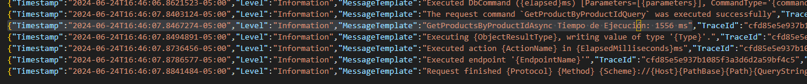

# Bienvenido a la EA.Tekton.TechnicalTest.WebApi (API)
## Table of Contents
[General Info](#general-info)
[Technologies](#technologies)
[Installation](#installation)

### General Info
***
Documentación general para EA.Tekton.TechnicalTest.WebApi.
.NET Microservices Architecture, Design a DDD (Domain-Driven Design) Microservice, Identity ASP.NET Core / .NET 8

1. Se implementa arquitectura DDD incorporando injeccion de dependencias y patrones como unit work y CQRS:

2. Tambien se usa patrones como unit work y repositorio:

3. Se usa una capa de funciones transversales, entre la cuales se encuentra memoryCache:

   

5. se implementa el maneja de cache para recuperar el status:
   

7. Se recupera el descuento de la API externa: https://66745f7375872d0e0a9638ed.mockapi.io/api/v1/Discount

8. Se deja en el log todo el rastreo e información de comandos, tambien el tiempo de repuesta
   

10. El log se configura en appsettings.json:
    

## Technologies
***
* [API.Net 8.0] https://dotnet.microsoft.com/es-es/download/dotnet/8.0
* [SQL SERVER] SQL 2019
* [Swagger] https://github.com/domaindrivendev/Swashbuckle.AspNetCore

## Installation
***
1. Clonar el proyecto https://github.com/ejbass79/EA.Tekton.TechnicalTest
2. Instalar el script SQL BCK-Test.sql 
3. Probar API en Postman 
4. Para poder realizar comandos de input update o get hay que que genera un jwt que se implemento para seguridad en los request:

5. poner el token en los comandos requeridos

